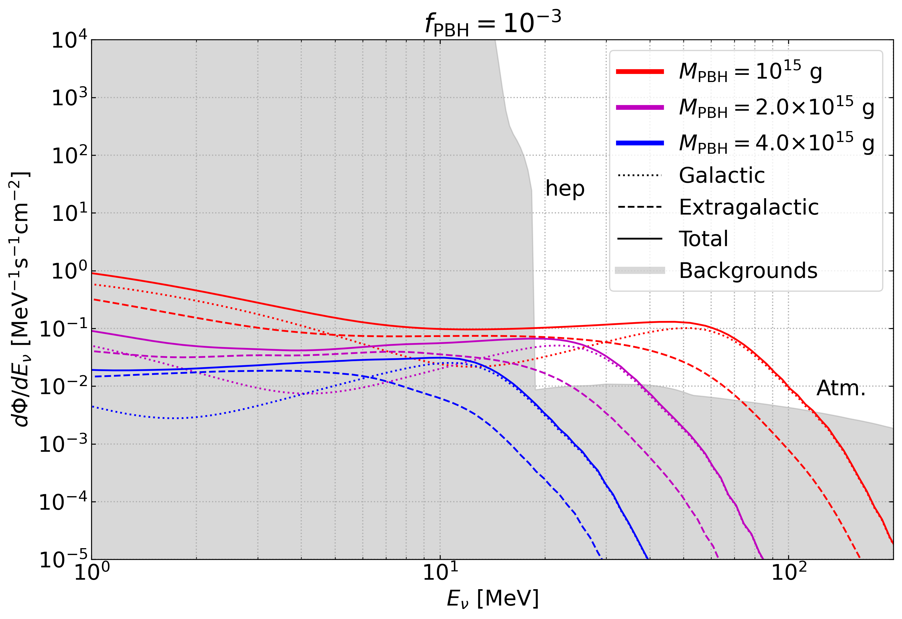

# νHawkHunter

<<<<<<< HEAD

=======

>>>>>>> 64959ea436124508362d98bc419e2c3a620e8851
  

Code to explore the prospects of detect neutrinos coming from evaporating Primordial Black Holes in future neutrino telescopes. It makes use of neutrino fluxes from Hawking radiation computed with the open source code [BlackHawk](https://blackhawk.hepforge.org/).

It is also suitable to be employed for Diffuse Supernova Neutrino Background or similar studies by replacing the signal fluxes by the proper ones.

In the following we present a brief explanation of the scripts included.

## Autoblackhawk

We include the driver `Autoblackhawk.py` to run the BlackHawk code for several masses and save the neutrino files. It must be placed in the main directory of BlackHawk, and modifies the parameter file and runs the code automatically according to the PBH masses indicated.

## Jupyter Notebooks

There are several Jupyter notebooks to plot relevant quantities and compute bounds.

- `plot_neutrino_spectrum.ipynb`: plot spectrum rates from BlackHawk.

- `plot_fluxes.ipynb`: computes the neutrino fluxes from the BlackHawk files.

- `plot_events.ipynb`: plots the event rate for the PBH signals and for the backgrounds.

- `PBH_constraints.ipynb`: computes the forecasted bounds on the PBH abundance for future experiments.

## Source

Here is a brief description of the scripts included in `Source`, where the relevant computations are defined:

- `constants.py`: contains definitions of relevant constants and initialization of several packages.

- `cosmo.py`: includes some useful cosmological functions.

- `evaporation.py`: includes functions related with the Hawking evaporation.

- `fluxes.py`: defines routines to compute the galactic and extragalactic fluxes.

- `cross_sections.py`: includes the relevant cross sections employed.

- `experiments.py`: contains the definition of the different experiments and the methods to compute the event rate for the PBH signals and for the backgrounds.

- `chi2.py`: defines functions to compute and interpolate the chi2.

## Citation

<<<<<<< HEAD
If you use the code, please link this repository, and cite [arXiv:2203.xxxx](https://arxiv.org/abs/2203.xxxx) and the DOI [10.5281/zenodo.6380821](https://www.zenodo.org/badge/latestdoi/364986991).
=======
If you use the code, please link this repository, and cite [arXiv:2111.xxxx](https://arxiv.org/abs/2111.xxxx) and the DOI [10.5281/zenodo.6380821](https://www.zenodo.org/badge/latestdoi/364986991).
>>>>>>> 64959ea436124508362d98bc419e2c3a620e8851

## Contact

For comments, questions etc. you can contact us at <vmmunoz2@uc.cl> or <pablo.villanueva.domingo@gmail.com>.
